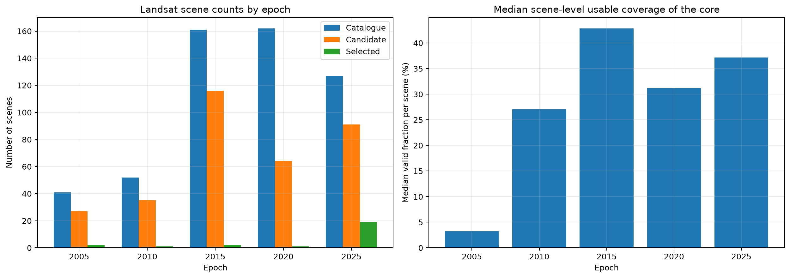
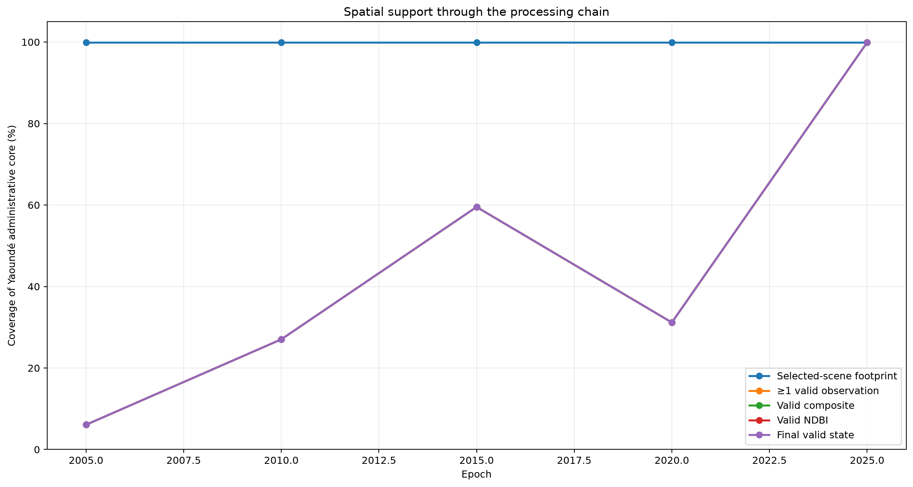
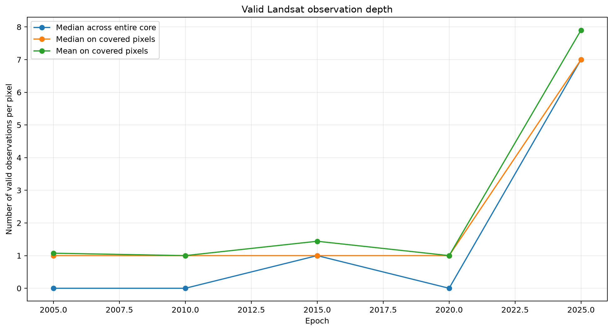
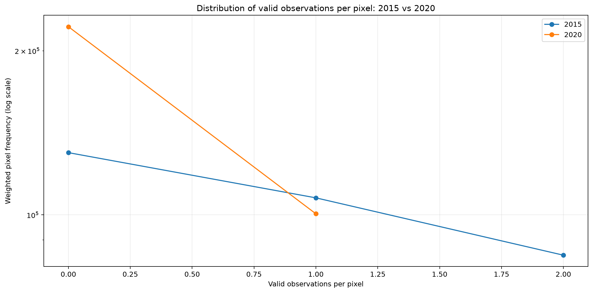
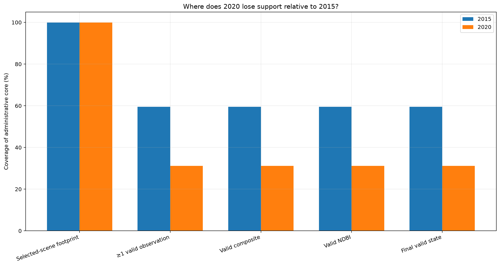

# Landsat Spatial-Support Diagnostic

## Objective

Determine why valid spatial support is lower in 2020 than in 2015 without changing the frozen compositing protocol.

## Definition

Valid spatial support is the area within the Yaoundé administrative core where the final Landsat composite contains usable pixels after QA masking and where NDBI can be calculated.

## Compositing protocol

|   epoch | window_name   | window_start   | window_end   | sensor_mode               | sensors   |   protocol_scene_count |
|--------:|:--------------|:---------------|:-------------|:--------------------------|:----------|-----------------------:|
|    2005 | Jul-Sep_3m    | 2005-07-01     | 2005-10-01   | primary_plus_supplemental | LT05,LE07 |                      2 |
|    2010 | Jul-Sep_3m    | 2010-07-01     | 2010-10-01   | primary_plus_supplemental | LT05,LE07 |                      1 |
|    2015 | Jul-Sep_3m    | 2015-07-01     | 2015-10-01   | primary_only              | LC08      |                      2 |
|    2020 | Jul-Sep_3m    | 2020-07-01     | 2020-10-01   | primary_only              | LC08      |                      1 |
|    2025 | Nov-Jan_3m    | 2024-11-01     | 2025-02-01   | primary_only              | LC08,LC09 |                     19 |

## Scene inventory

|   epoch |   catalogue_scene_count |   candidate_scene_count |   selected_scene_count | selected_sensors   | first_selected_date   | last_selected_date   |   median_selected_scene_cloud_cover_pct |   median_selected_scene_valid_fraction_core | window_name   | window_start   | window_end   | sensor_mode               | sensors   |   protocol_scene_count |
|--------:|------------------------:|------------------------:|-----------------------:|:-------------------|:----------------------|:---------------------|----------------------------------------:|--------------------------------------------:|:--------------|:---------------|:-------------|:--------------------------|:----------|-----------------------:|
|    2005 |                      41 |                      27 |                      2 | LE07               | 2005-07-19            | 2005-08-20           |                                  75     |                                   0.0326243 | Jul-Sep_3m    | 2005-07-01     | 2005-10-01   | primary_plus_supplemental | LT05,LE07 |                      2 |
|    2010 |                      52 |                      35 |                      1 | LE07               | 2010-09-19            | 2010-09-19           |                                  62     |                                   0.270345  | Jul-Sep_3m    | 2010-07-01     | 2010-10-01   | primary_plus_supplemental | LT05,LE07 |                      1 |
|    2015 |                     161 |                     116 |                      2 | LC08               | 2015-07-07            | 2015-07-07           |                                  56.285 |                                   0.428494  | Jul-Sep_3m    | 2015-07-01     | 2015-10-01   | primary_only              | LC08      |                      2 |
|    2020 |                     162 |                      64 |                      1 | LC08               | 2020-08-05            | 2020-08-05           |                                  69.1   |                                   0.311741  | Jul-Sep_3m    | 2020-07-01     | 2020-10-01   | primary_only              | LC08      |                      1 |
|    2025 |                     127 |                      91 |                     19 | LC08,LC09          | 2024-11-04            | 2025-01-31           |                                  37.9   |                                   0.371503  | Nov-Jan_3m    | 2024-11-01     | 2025-02-01   | primary_only              | LC08,LC09 |                     19 |

## Support by processing stage

|   epoch | window_name   | selected_sensors   |   candidate_scene_count |   selected_scene_count |   median_valid_observations_all_core |   median_valid_observations_covered |   footprint_pct_of_core |   coverage_ge_1_pct_of_core |   coverage_ge_3_pct_of_core |   valid_composite_pct_of_core |   valid_ndbi_pct_of_core |   final_state_valid_pct_of_core | dominant_loss_stage                  |
|--------:|:--------------|:-------------------|------------------------:|-----------------------:|-------------------------------------:|------------------------------------:|------------------------:|----------------------------:|----------------------------:|------------------------------:|-------------------------:|--------------------------------:|:-------------------------------------|
|    2005 | Jul-Sep_3m    | LE07               |                      27 |                      2 |                                    0 |                                   1 |                   99.89 |                        6.07 |                        0    |                          6.07 |                     6.07 |                            6.07 | scene_footprint_to_valid_observation |
|    2010 | Jul-Sep_3m    | LE07               |                      35 |                      1 |                                    0 |                                   1 |                   99.89 |                       27.03 |                        0    |                         27.03 |                    27.03 |                           27.03 | scene_footprint_to_valid_observation |
|    2015 | Jul-Sep_3m    | LC08               |                     116 |                      2 |                                    1 |                                   1 |                   99.89 |                       59.52 |                        0    |                         59.52 |                    59.52 |                           59.52 | scene_footprint_to_valid_observation |
|    2020 | Jul-Sep_3m    | LC08               |                      64 |                      1 |                                    0 |                                   1 |                   99.89 |                       31.17 |                        0    |                         31.17 |                    31.17 |                           31.17 | scene_footprint_to_valid_observation |
|    2025 | Nov-Jan_3m    | LC08,LC09          |                      91 |                     19 |                                    7 |                                   7 |                   99.89 |                       99.89 |                       99.87 |                         99.89 |                    99.89 |                           99.89 | core_to_scene_footprint              |

## Direct comparison: 2015 versus 2020

| metric                                |   2015 |   2020 |   2020_minus_2015 |
|:--------------------------------------|-------:|-------:|------------------:|
| Catalogue scenes                      | 161    | 162    |              1    |
| Candidate scenes                      | 116    |  64    |            -52    |
| Selected scenes                       |   2    |   1    |             -1    |
| Median scene cloud cover (%)          |  56.28 |  69.1  |             12.81 |
| Selected-scene footprint (%)          |  99.89 |  99.89 |             -0    |
| Coverage with ≥1 observation (%)      |  59.52 |  31.17 |            -28.35 |
| Coverage with ≥3 observations (%)     |   0    |   0    |              0    |
| Median observations across core       |   1    |   0    |             -1    |
| Median observations on covered pixels |   1    |   1    |              0    |
| Valid composite coverage (%)          |  59.52 |  31.17 |            -28.35 |
| Valid NDBI coverage (%)               |  59.52 |  31.17 |            -28.35 |
| Final valid-state coverage (%)        |  59.52 |  31.17 |            -28.35 |

## Diagnostic interpretation

- For 2005, the dominant support loss is `scene_footprint_to_valid_observation` (93.81 percentage points). The largest loss occurs between scene footprints and pixels with at least one valid observation. This points primarily to QA masking, clouds, cloud shadows, saturation, or missing usable observations inside the selected scenes.
- For 2010, the dominant support loss is `scene_footprint_to_valid_observation` (72.85 percentage points). The largest loss occurs between scene footprints and pixels with at least one valid observation. This points primarily to QA masking, clouds, cloud shadows, saturation, or missing usable observations inside the selected scenes.
- For 2015, the dominant support loss is `scene_footprint_to_valid_observation` (40.37 percentage points). The largest loss occurs between scene footprints and pixels with at least one valid observation. This points primarily to QA masking, clouds, cloud shadows, saturation, or missing usable observations inside the selected scenes.
- For 2020, the dominant support loss is `scene_footprint_to_valid_observation` (68.71 percentage points). The largest loss occurs between scene footprints and pixels with at least one valid observation. This points primarily to QA masking, clouds, cloud shadows, saturation, or missing usable observations inside the selected scenes.
- For 2025, the dominant support loss is `core_to_scene_footprint` (0.11 percentage points). The largest loss occurs before QA masking because the selected-scene footprints do not cover the full core.

## 2015–2020 conclusion

The 2020 scenes cover more area than the final usable support. The main 2015–2020 difference appears after QA masking, because 2020 has fewer pixels with at least one valid observation.

The final valid-state difference is -28.35 percentage points (2020 minus 2015).

## Methodological decision

The current temporal-window decision rule remains unchanged. No epoch has been manually reprocessed as part of this diagnostic.

## Generated figures

### 01 Scene Inventory

### 02 Coverage By Processing Stage

### 03 Observation Depth By Epoch

### 04 Observation Histogram 2015 2020

### 05 Comparison 2015 2020

